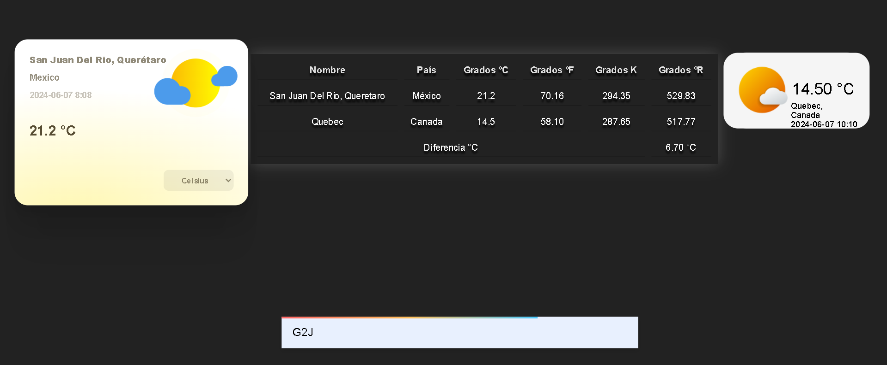

# Documentación

## 1. Weather API

## 2. Índice
- [Bibliografía](#6-bibliografía)
- [Conclusiones](#7-conclusiones)

## COMMING SOON

## 6. Bibliografía

- Documentación de WeatherAPI: [Enlace](https://www.weatherapi.com/docs/)
- MDN Web Docs: [JavaScript](https://developer.mozilla.org/en-US/docs/Web/JavaScript)
- UI Verse: [1. Weather Card](https://uiverse.io/zanina-yassine/neat-starfish-50)
- UI Verse: [2. Weather Card](https://uiverse.io/Praashoo7/old-dingo-81)

## 7. Conclusiones

El código proporciona una forma eficaz de obtener y mostrar datos de clima en una página web, permitiendo al usuario comparar temperaturas entre diferentes ubicaciones y escalas de temperatura.
